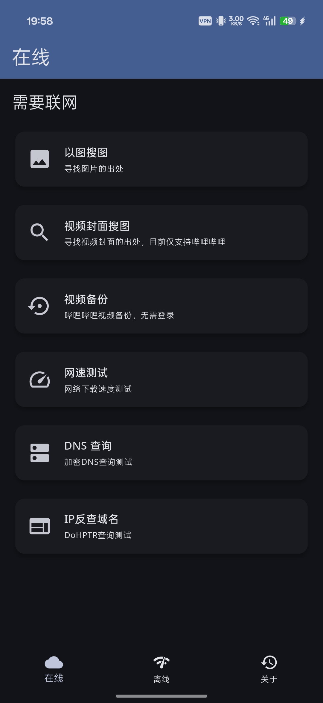
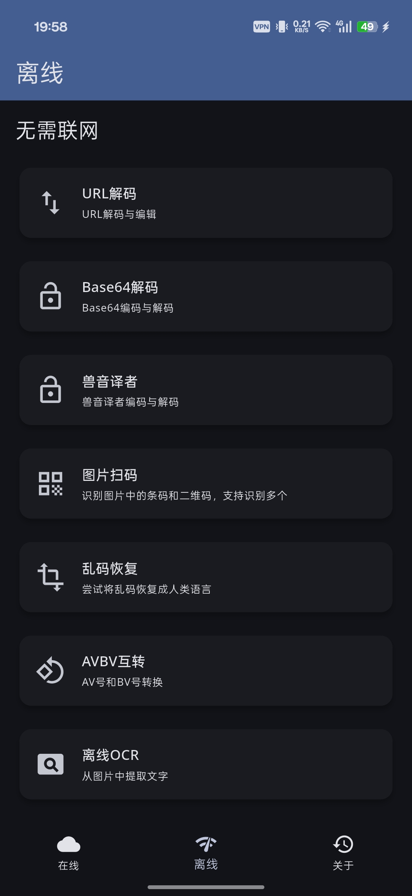
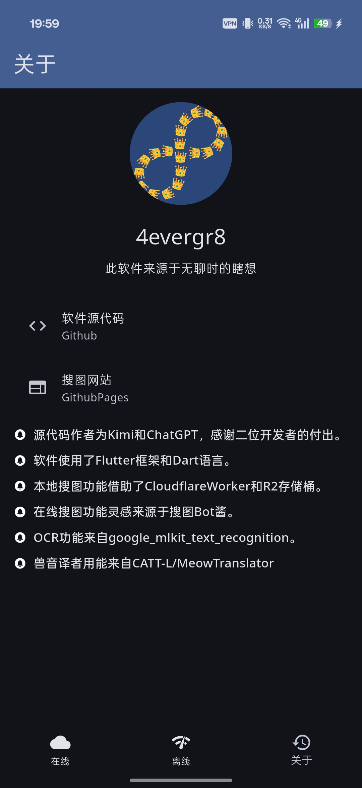

  

<h3 align="center">A Toolbox</h3>

  

    用Flutter框架制作的工具APP
     
    图片搜索，离线翻译，文字识别，网络测速，DNS查询，扫码识别，内网扫描，收藏备份，视频下载
     
    <a href="https://github.com/4evergr8/atoolbox/issues/new">🐞故障报告</a>
    ·
    <a href="https://github.com/4evergr8/atoolbox/issues/new">🏹功能请求</a>
  

## 主要功能
### 在线功能
* 搜索本地图片和网络图片
* 搜索哔哩哔哩视频封面
* 备份哔哩哔哩收藏夹
* 批量下载哔哩哔哩视频
* 下载大文件测试网速
* 加密DNS查询
### 离线功能
* URL解码
* Base64编码解码
* AVBV互转
* 离线扫码
* 扫描局域网设备
* 扫描设备端口
* 图片文字提取（OCR）
* 离线翻译（支持中、英、日、韩、俄互译，需要下载模型）
## 软件截图

  
  

  
 

## 支持的图片搜索引擎
* [Google（综合）](https://www.google.com/searchbyimage?client=app&image_url=https://picsum.photos/200/200?random=1)
* [Google Lens（综合）](https://lens.google.com/uploadbyurl?url=https://picsum.photos/200/200?random=1)
* [Yandex.eu（综合）](https://yandex.eu/images/search?url=https://picsum.photos/200/200?random=1&rpt=imageview)
* [Yandex.ru（综合）](https://yandex.ru/images/search?url=https://picsum.photos/200/200?random=1&rpt=imageview)
* [Bing（综合）](https://www.bing.com/images/search?q=imgurl:https://picsum.photos/200/200?random=1&view=detailv2&iss=sbi)
* [TinEye（综合）](https://tineye.com/search/?url=https://picsum.photos/200/200?random=1)
* [3DIQDB（Cosplay等）](https://3d.iqdb.org/?url=https://picsum.photos/200/200?random=1)
* [IQDB（画师作品，漫画）](https://iqdb.org/?url=https://picsum.photos/200/200?random=1)
* [SauceNAO（画师作品，漫画）](https://saucenao.com/search.php?url=https://picsum.photos/200/200?random=1)
* [ascii2d（画师作品，漫画）](https://ascii2d.net/search/url/https://picsum.photos/200/200?random=1)
* [WAIT（动漫截图）](https://trace.moe/?url=https://picsum.photos/200/200?random=1)
* [Trace.moe（动漫截图）](https://trace.moe/?url=https://picsum.photos/200/200?random=1)
